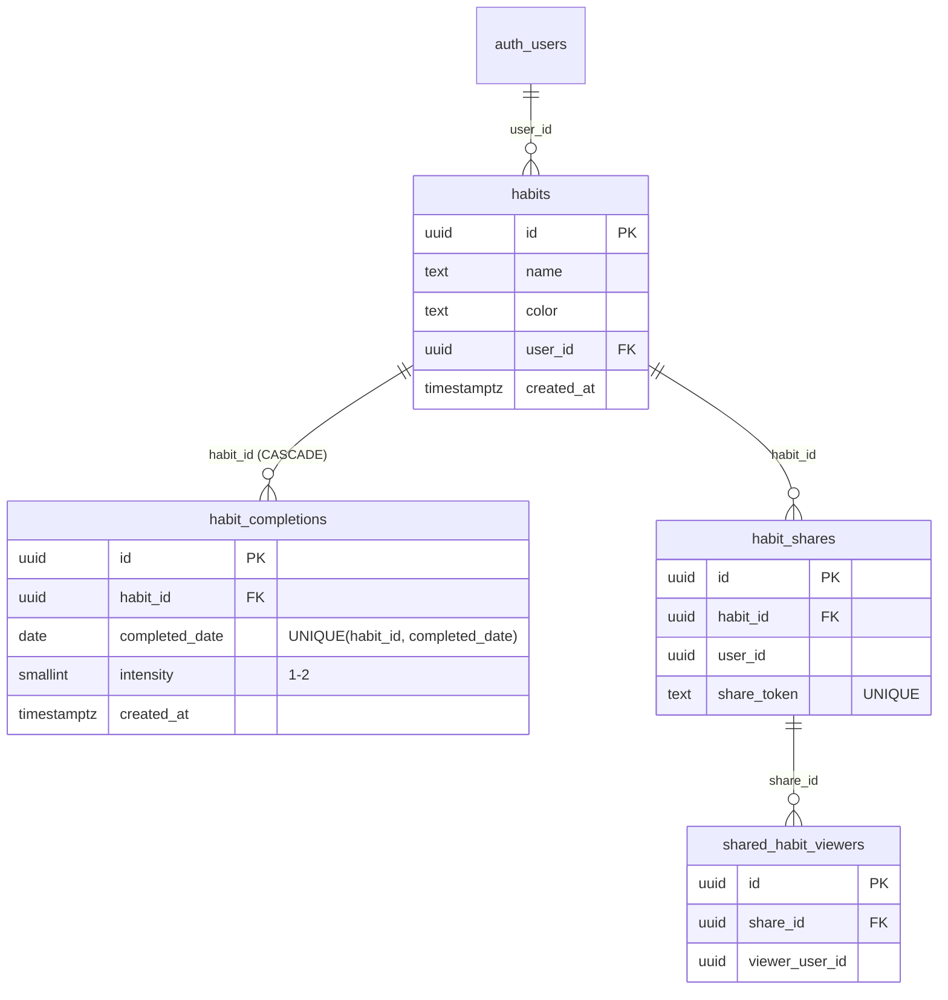

# Habitww 設計ドキュメント(アプリケーション内部)

毎日の習慣を記録し、GitHub 風の草グラフで可視化する習慣トラッカー。
外部連携(Supabase / Cloudflare / Google OAuth)は [integration.md](./integration.md) を参照。

## 技術スタック

| 領域 | 採用技術 |
|---|---|
| UI | React 19 + MUI v7 (@mui/material, @mui/icons-material, Emotion) |
| ビルド | Vite 8 (rolldown) + TypeScript 5.9 |
| BaaS | Supabase (@supabase/supabase-js v2) — DB / 認証 / Realtime |
| QR | qrcode.react(生成)、jsqr(カメラ読み取り) |
| フォント | @fontsource/roboto(セルフホスト) |

サーバーサイドコードは存在しない。純粋なクライアントサイド SPA で、ブラウザから
Supabase の Data API を直接呼ぶ構成。ルーターは使わず、`App.tsx` 内の
`useState<'habits' | 'stats' | 'share'>` と MUI `BottomNavigation` で画面を切り替える
(URL はナビゲーションで変化しない)。

## ディレクトリ構成

```
habitww_ng/
├── index.html            # エントリ。React マウント前の静的スケルトン(shimmer)入り
├── wrangler.jsonc        # Cloudflare Workers 設定(integration.md 参照)
├── src/
│   ├── main.tsx          # ReactDOM ルート、Roboto フォント読み込み
│   ├── App.tsx           # 中核(~1,000行): 認証状態、習慣CRUD、画面ナビゲーション
│   ├── supabase.ts       # Supabase クライアント生成 + 型定義(Habit 等)
│   ├── theme.ts          # MUI テーマ
│   ├── LoginPage.tsx     # Google ログイン画面
│   ├── StatsPage.tsx     # 統計画面
│   ├── ShareHabitsPage.tsx # 共有された習慣の閲覧画面(Realtime 購読)
│   ├── ShareModal.tsx    # 共有リンク/QR 生成、X(Twitter)シェア
│   ├── QRScannerDialog.tsx # カメラで共有QRを読み取る(getUserMedia + jsqr)
│   ├── ActivityGrid.tsx  # 草グラフ
│   ├── AchievementDots.tsx
│   ├── SkeletonFallbacks.tsx # lazy load 中のフォールバック
│   └── vite-env.d.ts     # 環境変数の型定義
├── public/               # 静的アセット(アイコン、manifest.json)
├── supabase/migrations/  # DB スキーマ(下記)。適用方法は integration.md
└── docs/                 # 本ドキュメント
```

## 画面と機能

- **ログイン** (`LoginPage.tsx`): Google OAuth のみ。未ログイン時に表示
- **習慣** (`App.tsx` 内): 習慣の作成/編集/削除、当日タップで完了記録。
  タップを重ねると intensity(1=達成, 2=ばっちり達成)が切り替わる。
  記録操作時に `navigator.vibrate` で触覚フィードバック(対応端末のみ)
- **統計** (`StatsPage.tsx`): 草グラフ・達成率などの可視化
- **共有** (`ShareModal.tsx` / `ShareHabitsPage.tsx` / `QRScannerDialog.tsx`):
  - 自分の習慣の共有リンク(`/?shareToken=<token>`)と QR を生成
  - 受け取り側は URL を開くか QR をカメラで読むと閲覧登録され、
    以後その習慣の記録を**閲覧専用**でリアルタイムに見られる
  - shareToken は `App.tsx` 起動時に `URLSearchParams` で読み取り、
    処理後に `history.replaceState` で URL から除去する

## データモデル

`supabase/migrations/` の SQL が正。2026-08 時点の最終形:



### RLS(Row Level Security)方針

- `habits` / `habit_completions`: 所有者(`habits.user_id = auth.uid()`)のみ
  読み書き可。completions は habit の所有を EXISTS で辿って判定
- 共有: `shared_habit_viewers` に登録された閲覧者は対象 habit と
  completions を **SELECT のみ** 可能。共有前の習慣名確認用に
  `habit_shares` に載っている習慣名は誰でも読める
- 履歴上の注意: `20260705035317` が completions の UPDATE を全開放して
  いたが、`20260830000000_fix_completion_update_policy.sql` で所有者限定に修正済み

## 実装上の特記事項

- **コード分割**: `vite.config.ts` の `rolldownOptions` で vendor-react /
  vendor-mui / vendor-supabase をチャンク分離。画面コンポーネントは lazy import
- **初期表示**: `index.html` に CSS のみのスケルトン UI を直書きし、
  JS ロード前から画面骨格を見せる(ダークモードは `prefers-color-scheme` 対応)
- **セッション**: supabase-js のデフォルト(localStorage 保存、自動リフレッシュ)
- **PWA**: `public/manifest.json` で standalone 表示・ホーム追加に対応。
  Service Worker は未実装(オフライン非対応)
- **Realtime**: `ShareHabitsPage.tsx` が `habit_completions` / `habit_shares` の
  postgres_changes を購読(チャンネル名 `share-habits-realtime`)
