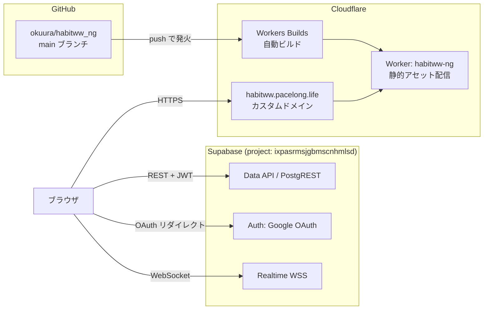

# Habitww 外部連携ドキュメント(インフラ・デプロイ・認証)

アプリ内部の設計は [design.md](./design.md) を参照。

## 全体構成



- Cloudflare Worker は**静的ファイル配信のみ**(Worker スクリプトなし、`wrangler.jsonc` の assets 設定のみ)
- DB・認証・リアルタイムはすべてブラウザ ⇔ Supabase の直接通信

## Cloudflare(配信・デプロイ)

### デプロイフロー(通常運用)

**`main` に push するだけ**。GitHub 連携(Workers Builds)が自動で
`npm run build` → `npx wrangler deploy` を実行する。手動デプロイは
`npm run deploy`(要 `npx wrangler login`)。

| 設定 | 値 |
|---|---|
| Worker 名 | `habitww-ng` |
| 接続リポジトリ | `okuura/habitww_ng`(branch: main) |
| Build command | `npm run build` |
| Deploy command | `npx wrangler deploy` |
| 公開 URL | https://habitww.pacelong.life(workers.dev 側: habitww-ng.okuuraw.workers.dev) |

- カスタムドメインは `wrangler.jsonc` の `routes`(`custom_domain: true`)で宣言。
  デプロイ時に DNS レコードと証明書が自動管理される(pacelong.life ゾーンは Cloudflare 管理)
- SPA のため `not_found_handling: "single-page-application"` を設定
  (未知パスは index.html を返す)

### 環境変数(重要)

`VITE_SUPABASE_URL` / `VITE_SUPABASE_ANON_KEY` の2つ。
**Vite がビルド時に JS へインライン化する**ため、Cloudflare では
Worker のランタイム変数/Secrets ではなく **Build variables** に設定すること
(ダッシュボード → Worker → Settings → Build)。値を変えたら再ビルドが必要。

ローカルは `.env`(gitignore 済み。雛形は `.env.example`)。

### ハマりどころ(実績あり)

- **push してもビルドが始まらない** → GitHub の
  Settings → Integrations → GitHub Apps で「Cloudflare Workers and Pages」の
  Repository access に本リポジトリが含まれているか確認(2026-08 の初期構築時、
  ここが未選択でビルドが発火しなかった)
- ビルド変数の設定漏れ → ビルドは成功するがアプリが白画面/接続エラーになる

## Supabase(DB・認証・Realtime)

- プロジェクト: `ixpasrmsjgbmscnhmlsd`(URL: https://ixpasrmsjgbmscnhmlsd.supabase.co)
- 使用機能: Data API(PostgREST)、Auth(Google)、Realtime。
  Edge Functions / Storage / RPC は未使用
- anon key(publishable key)は公開前提のキー。値は Dashboard →
  Project Settings → API Keys で確認(アクセス制御は RLS が担う)

### スキーマ管理

`supabase/migrations/*.sql` が正。新環境構築時はファイル名の日付順に
SQL Editor で実行するか、`npx supabase link` → `npx supabase db push`。

構築時に追加で必要な設定:

1. **Realtime**: `habit_completions` と `habit_shares` を publication
   `supabase_realtime` に追加(共有画面のリアルタイム反映に必須)
   ```sql
   ALTER PUBLICATION supabase_realtime ADD TABLE habit_completions;
   ALTER PUBLICATION supabase_realtime ADD TABLE habit_shares;
   ```
2. プロジェクト作成時のオプションは Data API 有効・テーブル自動公開 ON で作る
   (マイグレーションに GRANT 文がなく、自動公開前提のため)

### 認証(Google OAuth)

フロー: アプリの「Google でログイン」→ `signInWithOAuth({ provider: 'google',
redirectTo: window.location.origin })` → Google 同意画面 →
`https://ixpasrmsjgbmscnhmlsd.supabase.co/auth/v1/callback` → 元のオリジンへ戻る。

| 設定箇所 | 内容 |
|---|---|
| Google Cloud Console(OAuth クライアント) | 承認済みリダイレクト URI に `https://ixpasrmsjgbmscnhmlsd.supabase.co/auth/v1/callback` |
| Supabase → Auth → Providers | Google 有効化、Client ID / Secret を設定 |
| Supabase → Auth → URL Configuration | Site URL: `https://habitww.pacelong.life`。Redirect URLs: 本番 URL + `http://localhost:5173`(開発用) |

- `redirectTo` は実行時のオリジンをそのまま使うため、**新しいドメインで
  動かすときは必ず Redirect URLs への追加が必要**(忘れるとログイン後に戻れない)
- 既知の制約: Google の同意画面に「ixpasrmsjgbmscnhmlsd.supabase.co に移動」と
  表示される。解消には Supabase カスタムドメイン(Pro プラン + アドオン、有料)が
  必要と判断し、現状は許容している

## ローカル開発

```bash
npm install
cp .env.example .env   # Supabase の URL / anon key を記入
npm run dev            # http://localhost:5173
npm run build          # 本番ビルド(tsc + vite build)
npx wrangler dev       # ビルド済み dist/ を Workers 相当の挙動で確認
```

## 沿革

- 2026-05: bolt.new 上で開発・運用開始(habitww.bolt.host)
- 2026-08-30: Cloudflare Workers + 新規 Supabase プロジェクトへ移植
  (リポジトリを `okuura/habitww` → `okuura/habitww_ng` に分離)。
  旧環境の全データ(習慣3件・記録309件)は Data API 経由でエクスポートし
  SQL で移行済み。旧 `habitww` リポジトリは bolt 連携のまま凍結
